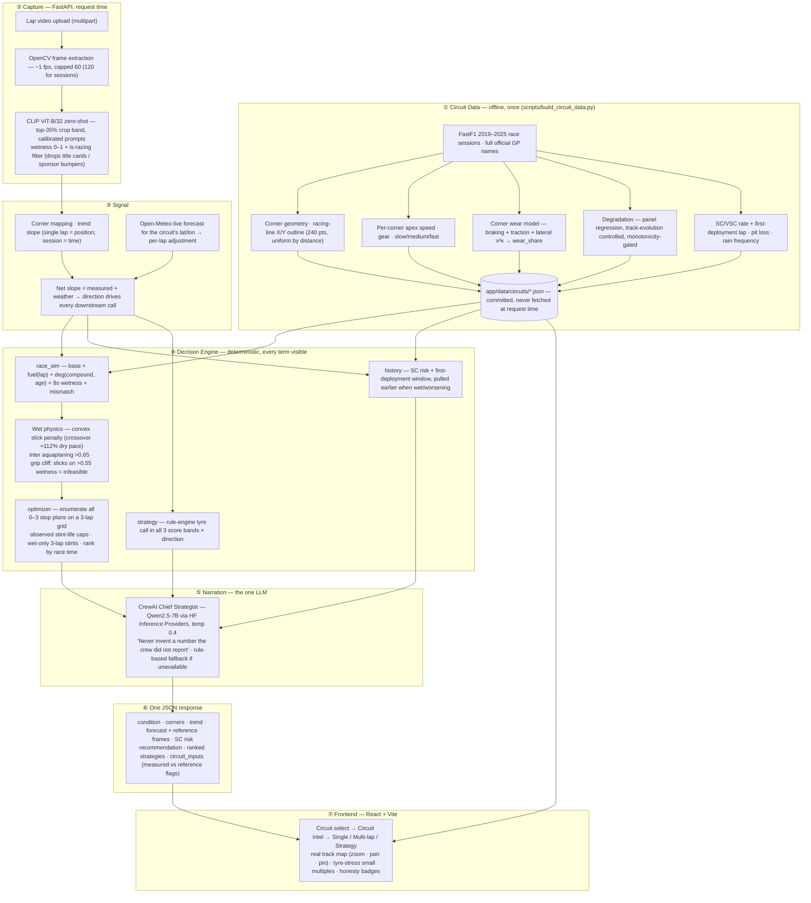

# TrackPulse

> The pit wall has telemetry. It doesn't have eyes. We give it eyes — and show our work.

TrackPulse turns onboard footage into a race-engineer's call. Load a lap, and one honest pipeline reads the track surface, trends it against live weather, prices every pit strategy against seven seasons of real F1 history, and hands the strategist a decision — with every number either real or labelled as a model.

**[Live App](https://d2jwudtuujhq9x.cloudfront.net)** · backend API at [3.109.18.197.sslip.io](https://3.109.18.197.sslip.io/docs) · Continue as guest, or sign up (browser-local) to keep a per-user run history.

Built for the **Weather Whiplash** hackathon problem statement — a live track-condition detector — and expanded into a compressed simulation of an F1 strategist's job across five circuits: Silverstone, Monaco, Spa-Francorchamps, Monza, Suzuka.

---

## How it works

Pick a circuit, pick a mode, load footage. Four entry points, one deterministic engine, one LLM that only narrates:

| | Input | What the engine does |
|---|---|---|
| **Intel** | Circuit pick (no footage) | Loads real FastF1 race history → zoomable racing-line map with per-corner telemetry, SC/VSC windows, pit loss, rain frequency, corner character, measured degradation |
| **Single Lap** | One lap of onboard video | OpenCV frames → CLIP wetness per frame → non-racing filter → corner mapping → trend + Open-Meteo forecast → SC risk → tyre call → CrewAI radio call |
| **Multi-Lap Session** | Several laps of video | Buckets frames into laps → lap-average trend over *time* (not track position) → corner-by-corner drying-line table with estimated dry lap |
| **Race Strategy** | Optional footage | CLIP read → projected track state per race lap → lap-time model → every 0–3 stop plan simulated (thousands) → ranked with gap to alternatives, wet-tyre physics, safety-car window, turn-by-turn tyre stress per compound |

Every recommendation ships with its evidence: the wetness curve that unlocked intermediates, the measured-vs-reference degradation badge, the "track position not modelled" caveat when a lower-stop plan is inside the noise. **A modelled number is never presented as a measurement.**

---

## Architecture

<details>
<summary>System diagram</summary>



</details>

---

## Stack

| Layer | Technology |
|---|---|
| Frontend | React 19 + Vite + TypeScript · Tailwind CSS 4 · Recharts · hand-rolled SVG track map (zoom/pan/pin, no mapping lib) |
| Backend | FastAPI + Uvicorn · Python 3.11 · uv-managed · async endpoints, sync CPU pipeline |
| Vision | Hugging Face `transformers` · **CLIP `openai/clip-vit-base-patch32`** zero-shot · OpenCV frame extraction · PIL |
| Agent | **CrewAI** · `Qwen/Qwen2.5-7B-Instruct` via Hugging Face Inference Providers (`HF_LLM_MODEL` overridable) · deterministic fallback |
| Data | **FastF1** (offline build → committed JSON) · **Open-Meteo** (`minutely_15` precipitation + probability, live) · NumPy / pandas regression |
| Storage | None at runtime — circuit JSON read-only in memory · uploads + frames on local disk under `/media/{session}` (ephemeral) · accounts + run history in browser `localStorage` (no server-side users) |
| Infra | **EC2** `t3.micro` (free-tier, 2GB swapfile for CLIP headroom) + **nginx** + Let's Encrypt · **S3** + **CloudFront** (separate distribution for the frontend) · AWS `ap-south-1` |
| Quality | strict `tsc` · oxlint · `test_strategy.py` · `test_weather_branches.py` (8/8) · `validate_replay.py` scores the optimiser against real 2023 race results |

---

## Running locally

Prerequisites: [uv](https://docs.astral.sh/uv/) · Node.js 20+.

**Backend**

```bash
cd backend
uv sync

# No API keys needed — runs fully with rule-based strategist text
uv run uvicorn app.main:app --reload --port 8000
```

First start downloads the CLIP weights (~600 MB, 1–2 min) into `backend/.hf_cache`; cached after that. Circuit data is already committed — FastF1 is **never** called at request time.

To enable the CrewAI radio-call synthesis, `cp .env.example .env` and set:

```env
HF_TOKEN=hf_...                                        # needs "Make calls to Inference Providers" permission
# HF_LLM_MODEL=huggingface/Qwen/Qwen2.5-7B-Instruct    # optional override, any ungated model your token can reach
```

Without a token the response still returns — `strategist_note` is the deterministic rule-engine text and `agent_synthesis_used: false`; the footer shows "Rule-based fallback".

**Frontend**

```bash
cd frontend
npm install
npm run dev    # http://localhost:5173 → calls http://localhost:8000
```

Point it elsewhere with `VITE_API_BASE=https://your-backend` (build with `VITE_API_BASE=""` for the same-origin CloudFront deploy).

**Rebuilding circuit data** (only if you add a circuit or want fresh seasons — slow, needs internet):

```bash
uv run python scripts/build_circuit_data.py                    # all 5, ~tens of minutes first run
uv run python scripts/build_circuit_data.py --circuit spa      # one circuit
uv run python scripts/build_circuit_data.py --telemetry-only   # fast: re-patch outline / apex / wear only
```

> Use **full official GP names** in `CIRCUITS` (`"Belgian Grand Prix"`, not `"Spa"`) — FastF1's fuzzy lookup once silently resolved `"Spa"` to the *Spanish* GP and every Spa signal was Barcelona's. The build log prints `event resolved: …` as a check.

---

## API

| Endpoint | Body | Returns |
|---|---|---|
| `GET /api/circuits` | — | Picker summaries incl. `track_outline` for the mini-maps |
| `GET /api/circuits/{id}` | — | Full circuit record: corners (apex, gear, class, `wear_share`), degradation + confidence, SC stats, `track_outline` |
| `POST /api/analyze` | `video`, `circuit_id?` | Single-lap strategist report (condition, corners, trend, forecast + reference frames, SC risk, tyre call, radio call) |
| `POST /api/analyze-session` | `video`, `circuit_id`, `lap_duration_sec?` | Multi-lap report: per-lap summaries, time-based trend, forecast, recommendation |
| `POST /api/strategy/plan` | `circuit_id`, `video?`, `race_laps?` | Ranked 0–3 stop plans, best per stop count, `wet_race`, `compounds_considered`, `circuit_inputs` with `degradation_in_use` |
| `GET /media/{session}/frames/{file}` | — | Extracted frames (referenced by every `image_url`) |

`frontend/src/types.ts` mirrors these shapes exactly — it is the contract.

---

## Deployment

**Live**: frontend at [d2jwudtuujhq9x.cloudfront.net](https://d2jwudtuujhq9x.cloudfront.net), backend API at [3.109.18.197.sslip.io](https://3.109.18.197.sslip.io/docs).

Production is **EC2 (Docker) + nginx + S3 + CloudFront**, with the backend and frontend on separate origins rather than one path-routed distribution — CORS is wide open on the backend (`allow_origins=["*"]`), so there's no need to force them same-origin:

```
browser ── https ──▶ CloudFront (S3 origin)        →  frontend
browser ── https ──▶ nginx on EC2 (Let's Encrypt)  →  backend, proxied to the Docker container
```

1. **EC2** — `t3.micro` (free-tier eligible), Amazon Linux 2023, 2GB swapfile (CLIP's memory headroom on a 1GB instance), Docker. nginx terminates TLS and reverse-proxies to the container (`client_max_body_size 200M`, `proxy_read_timeout 300s` — CLIP inference on a free-tier CPU is slow). The TLS cert is Let's Encrypt for the instance's Elastic IP via `<ip>.sslip.io` — Let's Encrypt refuses to issue for `*.amazonaws.com`, so the instance's own AWS DNS name doesn't work; `sslip.io` is free magic DNS with no domain purchase needed.
2. **S3 + CloudFront** — private bucket, CloudFront reads it via Origin Access Control (no public bucket access). Frontend built with `VITE_API_BASE` pointed at the backend's HTTPS URL.
3. **Redeploy** — frontend: build → `aws s3 sync` → `create-invalidation --paths "/*"`; backend: tar the build context → scp → `docker build` → `docker run --restart unless-stopped`. Exact commands in the runbook below.
4. **Pause / resume** — `deploy/pause.sh` stops the instance and releases its Elastic IP for true $0 while idle (EBS volume with the built image is kept); `deploy/resume.sh` starts it back up, reissues the TLS cert for the new IP, and redeploys the frontend against it. No time limit — pause for a day or three months, same script either way.

Full click-by-click runbook, every command actually run, and every tradeoff: [`deploy/README.md`](./deploy/README.md). A `backend/Dockerfile` (bakes CLIP weights into the image) works on any Docker host, not just this one.

Cost discipline: an AWS Budget alerts by email past set spend thresholds. Everything here fits free tier except the Elastic IP (~$0.005/hr once an account is past its first 12 months) — `deploy/pause.sh` is how to get that to $0 too.

---

## Honesty notes (read before demoing)

- **Degradation is measured but often not trusted.** Real stint data conflates wear with track evolution and comes out non-monotonic (hard "wearing" faster than soft). The build flags such circuits `degradation_confidence: low` and the simulator runs on a reference curve — the UI badge says which. Never claim measured per-circuit wear drives the sim when it reads "reference".
- **Per-corner tyre stress is a model** (frictional work over real telemetry), not a measurement — labelled via `corner_wear_note` and the panel tooltip. It distributes real per-lap degradation across corners; it never invents a total.
- **The track map is one fast lap's racing line**, not the track edges.
- **Traffic and track position are not modelled** — the board says so whenever a lower-stop plan is within 15 s of optimal.
- **Vertical (9:16) video is out of scope** for the vision model. Don't demo with it.
- Validation against real 2023 races: stop count right 2/4, compound set 2/4, mean race-time error 4.6% — quote it as-is (and re-run `validate_replay.py` for Spa; the earlier number was computed on the wrong circuit).

More: [`CONTEXT.md`](./CONTEXT.md) (architecture, contract, every judgement call) · [`HANDOFF.md`](./HANDOFF.md) (session-by-session change log) · [`pptscript.md`](./pptscript.md) (pitch script).
