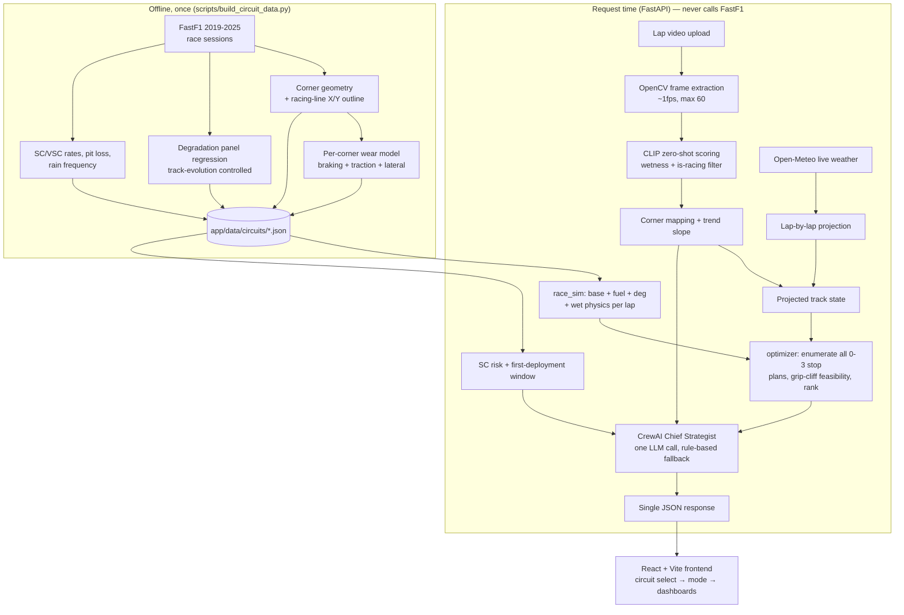

# TrackPulse — Presentation Script

> Speaker script + slide notes for the TrackPulse demo (Weather Whiplash hackathon).
> Each section = one slide (or two). Bold lines are the punchlines to say out loud.

---

## 1. Uniqueness

**"Every number on this screen is either real, or labeled as a model — and the UI tells you which."**

- Most hackathon "AI race strategy" demos are a chatbot with a prompt. TrackPulse is a
  **deterministic, inspectable pipeline** where the one LLM (CrewAI Chief Strategist) only
  *narrates* conclusions that real data already produced — and if the LLM is down, the app
  still works (rule-based fallback, honestly badged as such in the footer).
- **Real data end-to-end**: live weather from Open-Meteo, 7 seasons (2019–2025) of real
  FastF1 race telemetry per circuit, real onboard footage scored frame-by-frame by CLIP.
  No mock data anywhere — the README's core promise.
- **Honesty as a design system**: the "Honest Degradation" panel shows measured tyre wear
  even when the simulator refuses to use it (non-monotonic regression artifacts fall back
  to a reference curve — and a badge says so). The track map says "Racing line · FastF1
  telemetry" when it's real geometry and "Schematic layout" when it isn't. A modelled
  number is never silently presented as a measurement.
- **The vision layer is load-bearing, not decorative**: the CLIP wetness read decides which
  tyre compounds are even legal candidates in the strategy optimiser. Upload wet footage
  and the recommended plan visibly changes — at Suzuka, a drying track turns `M/H` slicks
  into an `I5 / M23 / M25` intermediate opening.

---

## 2. Bottleneck / Current Issue

**"Our bottleneck isn't compute — it's ground truth."**

- **No labeled wet-track dataset exists.** You cannot train a wetness classifier without
  40k labeled F1 frames, and nobody has them. Our answer: CLIP zero-shot scoring,
  *calibrated* against reference frames from real dry/wet races (scripts/calibrate_vision.py,
  sweep_crop.py pick the crop band that maximises dry/wet separation). It works, but it's a
  score, not a physical water-depth measurement.
- **Public telemetry conflates effects.** Tyre degradation measured from race stints mixes
  real wear with track evolution, fuel burn, and stint placement — which is why measured
  degradation sometimes comes out physically backwards (hard wearing faster than soft).
  We detect this (monotonicity check), flag the circuit low-confidence, and fall back to a
  reference curve rather than simulate on garbage.
- **First-load latency**: the CLIP model load makes cold-start ~2 minutes; per-video
  analysis is bounded (max 60 frames at ~1fps) to keep requests interactive.
- **Traffic/track-position is not modelled** — the optimiser simulates a clear track. We
  surface this honestly: when a lower-stop plan is within 15s of optimal, the UI says
  track position likely decides it, not raw pace.

---

## 3. Target Audience

- **Primary (demo framing): the pit-wall strategist persona** — anyone who has to make the
  "box now or stay out?" call under changing weather: sim-racing league strategists,
  motorsport engineering students, F1 fantasy/analytics enthusiasts.
- **Secondary: broadcasters & content creators** — the corner-by-corner tyre-stress and
  track-condition visuals explain *why* a strategy call happened, in a form viewers can read.
- **Tertiary: grassroots motorsport teams** — the same pipeline (footage → condition →
  recommendation) applies to any series with onboard cameras and weather exposure, where
  a real strategy department doesn't exist.
- The human stays the decision-maker: the app recommends, shows its work, and provides an
  Accept / Manual-override flow — it is a copilot, not an autopilot.

---

## 4. Current Approach vs Old — and Why It's Better

| | Old / typical approach | TrackPulse |
|---|---|---|
| Condition detection | Manual eyeball of radar + spotter reports | CLIP zero-shot per-frame wetness scoring from onboard video, corner-mapped |
| Trend | "It looks like it's drying" | Fitted slope per lap (measured) + weather adjustment (Open-Meteo) = net trend that drives the call |
| Strategy | Gut feel or a single pre-computed plan | Every 0–3 stop plan simulated (thousands of candidates), ranked by race time, with the gap to alternatives shown |
| Track map | Hand-drawn schematic | Real racing-line geometry from FastF1 X/Y telemetry; corner markers at true distances |
| Wet calls | Uniform "wet = slower" penalty (our own v1!) | Calibrated crossover physics: slicks→inters at ~110–112% of dry pace (Pirelli guidance), inter aquaplaning above 0.65 wetness, and a hard "grip cliff" rule — slicks on an undriveable lap are infeasible, not just slow |
| Trust | Black-box ML score | Every term visible and arguable: base lap + fuel + degradation + wet penalty + mismatch |

**"The old version of *our own app* recommended slicks on a soaked grid — because pure
lap-time arithmetic will happily trade a crash risk for a pit stop. The fix wasn't more
ML; it was better-calibrated, inspectable physics."** (That story is the whole thesis.)

---

## 5. Features

1. **Circuit selection first** — five circuits (Silverstone, Monaco, Spa, Monza, Suzuka),
   each card drawing its real racing-line mini-map with real stats (laps, avg lap, pit
   loss, SC rate, rain frequency).
2. **Circuit Intel dashboard** — tactical map with zoom/pan, corner markers you can hover
   *and pin* (click) for a telemetry callout: apex speed, gear, slow/medium/fast class,
   distance, lap position. Direction arrow + start/finish tick. Corner names curated to
   official F1 naming ("Turn 9 — Copse"). Corner Character panel: the circuit's DNA as a
   slow/medium/fast split with fastest/slowest corners.
3. **Single Lap mode** — one lap of footage → condition label, wetness score, per-corner
   analysis table (click a corner to focus its frame), trend + next-lap forecast with real
   reference frames, SC risk, tyre call, and the radio-call synthesis.
4. **Multi-Lap Session mode** — wetness compared lap-over-lap (a trend over *time*, not
   track position), lap strip with real thumbnails, corner-by-corner drying-line table
   with estimated dry lap.
5. **Race Strategy mode** — full-race pit-stop optimiser: ranked plans with stint bars,
   projected track state across the race with stop markers, safety-car window, and the
   **turn-by-turn tyre stress** small-multiples: per-compound expected time loss per
   corner, from a frictional-work model over real telemetry (braking + traction + lateral
   v²·curvature) × the same degradation values the simulator runs on.
6. **History & sessions** — per-user run history (browser-local accounts / guest mode).
7. **Honesty surfaces everywhere** — measured vs reference badges, "simulated not
   measured" notes, agent vs rule-based indicator.

---

## 6. Architecture Diagram

Talking point: **the line between the two halves is sacred** — everything historical is
computed once offline and committed as JSON; a demo can never die because an external API
is slow. The only live external call is the weather.

---

## 7. Tech Stack

- **Backend**: Python 3.11, FastAPI + Uvicorn, uv-managed dependencies
- **Vision**: Hugging Face `transformers`, CLIP (ViT-B/32) zero-shot classification, OpenCV
- **Data**: FastF1 (real telemetry, offline build), Open-Meteo (live weather), NumPy/pandas
  regression for degradation
- **Agent**: CrewAI, LLM via Hugging Face Inference Providers (optional, graceful fallback)
- **Frontend**: React 19 + TypeScript, Vite, Tailwind CSS v4, Recharts; hand-rolled SVG for
  the interactive track map (zoom/pan/pin without a mapping library)
- **Quality**: oxlint, strict tsc; validation scripts that replay the optimiser against
  real race results

---

## 8. Algorithm & Scaling Strategy

**Core algorithms (all inspectable):**
- *Wetness*: CLIP similarity between each frame's crop band and calibrated dry/damp/wet
  prompts → 0–1 score; non-racing frames filtered the same way.
- *Trend*: least-squares slope of wetness per lap, plus a weather adjustment; the sum
  ("net slope") drives direction, tyre call, and SC-risk sharpening.
- *Degradation*: per-race panel regression with driver fixed effects and a lap-number
  term absorbing track evolution — the only statistically honest way to separate wear
  from a track speeding up; monotonicity check gates whether the sim trusts it.
- *Lap-time model*: `base + fuel(lap) + deg(compound, age) + 8s·wetness +
  mismatch(compound, wetness)` — mismatch is convex for slicks (calibrated to Pirelli's
  110–112% crossover), includes inter aquaplaning above 0.65.
- *Optimiser*: exhaustive enumeration of 0–3 stop plans on a 3-lap grid with real
  observed stint-length caps and the slick grip-cliff feasibility rule — brute force on
  purpose; the search space is small and the answer is fully explainable.
- *Corner wear*: frictional work per unit mass integrated per corner tile (braking `v·dv/ds`,
  traction, lateral `v²κ` with curvature from real X/Y) → shares that distribute measured
  per-lap degradation across corners.

**Scaling strategy:**
- *Horizontal*: the request path is stateless (circuit JSON is read-only, cached in
  memory) → N uvicorn workers / containers behind a load balancer scale linearly.
- *The expensive part is CLIP*: batch frame scoring, GPU-host it once, or split it into a
  queue-fed worker pool; frames per request are already capped, so cost per request is
  bounded and predictable.
- *Adding circuits is data, not code*: one `build_circuit_data.py` run per circuit →
  commit the JSON. The entire F1 calendar is ~20 JSON files.
- *Precompute over recompute*: everything derivable offline stays offline; the optimiser's
  candidate space is deliberately gridded (3-lap resolution) so a full plan search stays
  in low seconds even with wet compounds and short-stint variants.

---

## 9. Future Vision

- **Live streaming ingestion** — replace one-shot upload with a continuous onboard feed;
  the multi-lap trend becomes a rolling live signal, and the strategy re-optimises every lap.
- **Track-position & traffic modelling** — undercut/overcut simulation against rival cars,
  turning the "track position caveat" from a disclaimer into a modelled term.
- **Probabilistic weather** — Monte-Carlo over Open-Meteo ensemble forecasts → strategy
  *distributions* ("inter window opens L8–L12 with 70% confidence") instead of point plans.
- **Safety-car-aware planning** — condition the optimiser on the deployment window we
  already estimate: "if SC before L12, pit under it; else target L18".
- **Per-compound corner physics** — thermal model so softs suffer traction zones and hards
  suffer warm-up, differentiating the turn-by-turn wear distribution per compound.
- **Human-in-the-loop learning** — log Accept/Override decisions and score the optimiser
  against what strategists actually chose (validate_replay.py already scores it against
  real race results).
- **Beyond F1** — the pipeline is series-agnostic: any championship with onboard cameras,
  weather exposure, and public timing data (F2, WEC, MotoGP, karting academies).

---

*Built for the Weather Whiplash hackathon — real vision, real weather, real race history,
and a UI that never pretends a model is a measurement.*
